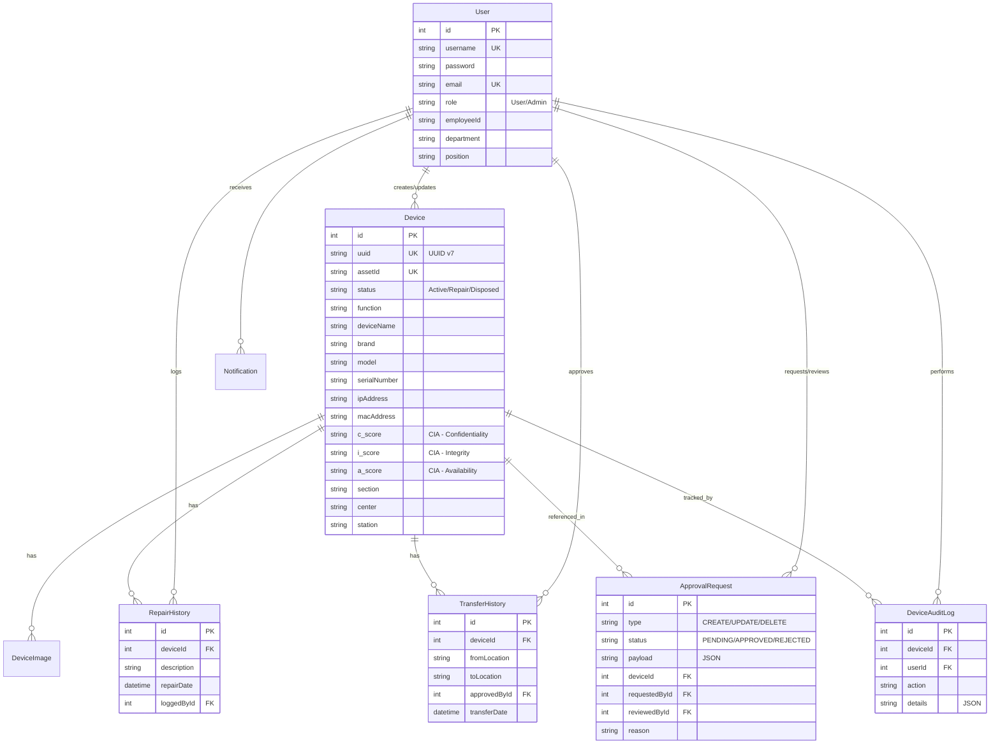

# 🏪 NAIWAH Store Management System

<div align="center">


**ระบบจัดการคลังอุปกรณ์ IT และการบำรุงรักษา**  
*IT Device Inventory & Maintenance Management System*

### 🎬 Demo Video

[](https://youtu.be/SPx7GichAN0)

▶️ **[Click to watch the demo on YouTube](https://youtu.be/SPx7GichAN0)**

</div>

---

## 📋 Overview

NAIWAH Store Management System เป็นระบบบริหารจัดการคลังอุปกรณ์ IT ที่ครบวงจร ออกแบบมาเพื่อติดตามสถานะอุปกรณ์, ประวัติการซ่อมบำรุง, การโอนย้าย และกระบวนการอนุมัติต่างๆ พร้อมระบบ QR Code สำหรับการค้นหาอุปกรณ์อย่างรวดเร็ว

### ✨ Key Features

| Feature | Description |
|---------|-------------|
| 🖥️ **Device Management** | เพิ่ม/แก้ไข/ลบ อุปกรณ์พร้อมข้อมูลครบถ้วน |
| 📱 **QR Code Scanner** | สแกน QR เพื่อเข้าถึงข้อมูลอุปกรณ์ทันที |
| 🔧 **Repair History** | บันทึกประวัติการซ่อมบำรุงทั้งหมด |
| 🔄 **Transfer History** | ติดตามการโอนย้ายอุปกรณ์ระหว่างสถานที่ |
| ✅ **Approval Workflow** | กระบวนการอนุมัติสำหรับการเปลี่ยนแปลงข้อมูล |
| 🛡️ **CIA Scoring** | ประเมินระดับความสำคัญ (Confidentiality, Integrity, Availability) |
| 👥 **Role-based Access** | ระบบ User/Admin สำหรับควบคุมสิทธิ์การเข้าถึง |
| 📧 **Email Notifications** | แจ้งเตือนผ่าน Email เมื่อมีการอนุมัติ |
| 📊 **Dashboard Analytics** | แดชบอร์ดแสดงสถิติและภาพรวมระบบ |
| 📄 **PDF Export** | ส่งออกรายงานอุปกรณ์เป็น PDF |

---

## 🏗️ Architecture Overview

<div align="center">


</div>

---

## 📂 Project Structure

```
store-app-antigrav/
├── 📁 app/                      # Next.js App Router
│   ├── 📁 api/                  # API Routes
│   ├── 📁 dashboard/            # Dashboard Pages
│   │   ├── 📁 admin/            # Admin Panel (User/Request Management)
│   │   ├── 📁 calendar/         # Calendar View
│   │   ├── 📁 cia/              # CIA Scoring Page
│   │   ├── 📁 devices/          # Device CRUD & Details
│   │   ├── 📁 history/          # History Viewer
│   │   └── 📁 requests/         # Approval Requests
│   └── 📁 login/                # Authentication Page
│
├── 📁 components/               # React Components
│   ├── 📁 admin/                # Admin-specific Components
│   ├── 📁 calendar/             # Calendar Components
│   ├── 📁 devices/              # Device Components (Forms, Tables, QR)
│   ├── 📁 history/              # History Display Components
│   ├── 📁 layout/               # Layout Components (Sidebar, Header)
│   └── 📁 ui/                   # shadcn/ui Components
│
├── 📁 lib/                      # Utilities & Business Logic
│   ├── 📁 actions/              # Server Actions
│   │   ├── approval.ts          # Approval Workflow Actions
│   │   ├── device.ts            # Device CRUD Actions
│   │   ├── history.ts           # History Actions
│   │   └── user.ts              # User Management Actions
│   ├── email.ts                 # Email Service
│   ├── prisma.ts                # Prisma Client
│   └── utils.ts                 # Utility Functions
│
├── 📁 prisma/                   # Database
│   └── schema.prisma            # Database Schema
│
├── 📁 context/                  # React Context Providers
├── 📁 public/                   # Static Assets
├── 📁 scripts/                  # Utility Scripts
└── 📁 types/                    # TypeScript Definitions
```

---

## 🗄️ Database Schema



---

## 🚀 Getting Started

### Prerequisites

- **Node.js** 18+ 
- **pnpm** (recommended) or npm/yarn
- **Docker** (optional, for PocketBase)

### Installation

```bash
# 1. Clone the repository
git clone <repository-url>
cd store-app-antigrav

# 2. Install dependencies
pnpm install

# 3. Copy environment variables
cp .env.example .env

# 4. Initialize database
pnpm prisma generate
pnpm prisma db push

# 5. Run development server
pnpm dev
```

### Environment Variables

| Variable | Description | Default |
|----------|-------------|---------|
| `AUTH_SECRET` | NextAuth.js secret key | - |
| `AUTH_URL` | Authentication callback URL | `http://localhost:3005` |
| `DATABASE_URL` | SQLite database path | `file:./dev.db` |
| `NEXT_PUBLIC_POCKETBASE_URL` | PocketBase server URL | `http://127.0.0.1:8090` |

---

## 🐳 Docker Deployment

```bash
# Build and run with Docker Compose
docker-compose up -d

# View logs
docker-compose logs -f
```

See [DEPLOYMENT.md](./DEPLOYMENT.md) for detailed deployment instructions.

---

## 🛠️ Tech Stack

| Category | Technology |
|----------|------------|
| **Framework** | Next.js 16 (App Router) |
| **Language** | TypeScript 5 |
| **Database** | SQLite + Prisma ORM |
| **Authentication** | NextAuth.js v5 (Beta) |
| **UI Library** | shadcn/ui + Radix UI |
| **Styling** | Tailwind CSS 4 |
| **Image Storage** | PocketBase |
| **Email** | EmailJS / Nodemailer |
| **Forms** | React Hook Form + Zod |
| **Tables** | TanStack Table |
| **Charts** | Recharts |
| **PDF Export** | jsPDF + html2canvas |
| **Animations** | Framer Motion |

---

## 📄 License

This project is proprietary software for internal use.

---

<div align="center">

**Made with ❤️ by ThaiPBS Engineering Department**

</div>
