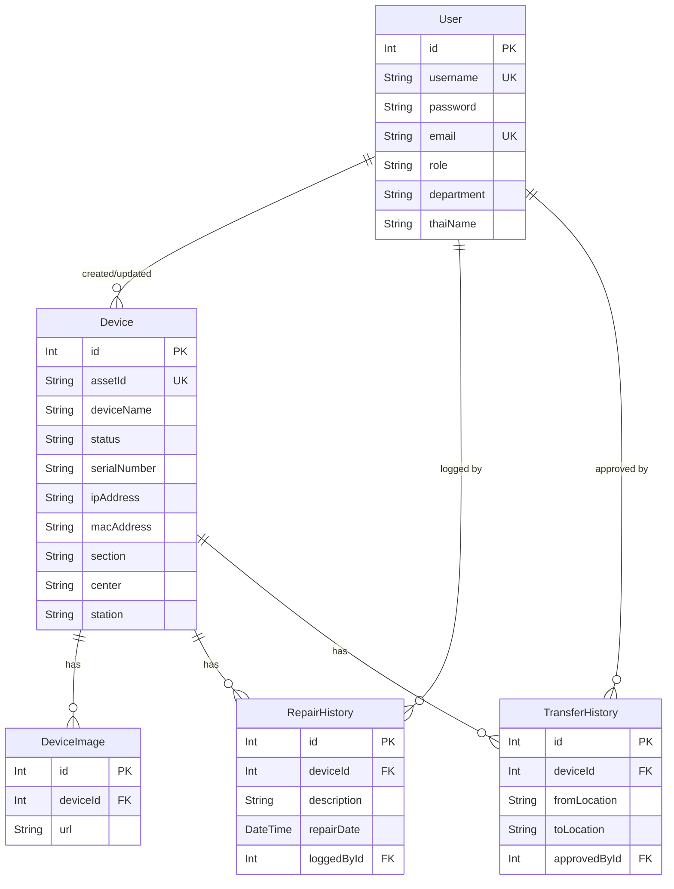

# Store Management System (NAIWAH) - Implementation Plan

## Learning Resources
- **Skill Reference**: [skill.md](file:///Users/user/Downloads/master_data/store-app-antigrav/planning/skill.md)
- **Task Checklist**: [task.md](file:///Users/user/Downloads/master_data/store-app-antigrav/planning/task.md)

## Context Data
- [681007AssetInventorytempleteMUX4(NOC)R5-01.md](file:///Users/user/Downloads/master_data/store-app-antigrav/context/681007AssetInventorytempleteMUX4(NOC)R5-01.md)
- [681007AssetInventorytempleteMUX4(NOC)R5-02.md](file:///Users/user/Downloads/master_data/store-app-antigrav/context/681007AssetInventorytempleteMUX4(NOC)R5-02.md)
- [database_example.csv](file:///Users/user/Downloads/master_data/store-app-antigrav/context/database_example.csv)
- [user_db.csv](file:///Users/user/Downloads/master_data/store-app-antigrav/user_db.csv)

---

## Goal Description

Design and implement a Store Management System named **"NAIWAH"** using:
- **Next.js 15** (App Router) - Frontend & API
- **Prisma + SQLite** - Database ORM
- **NextAuth.js v5** - Authentication with role-based access
- **PocketBase** - Image storage
- **shadcn/ui** - UI components

### Core Features
1. User management with role-based access (User/Admin)
2. Device inventory tracking with QR codes
3. Multi-image support via PocketBase
4. Repair and transfer history logging
5. Audit trails for all changes

---

## User Review Required

> [!IMPORTANT]
> **PocketBase Integration**: Confirm if PocketBase is running and accessible. Currently storing image URLs in database.

> [!WARNING]  
> **Password Migration**: CSV contains plain text passwords. Will hash with bcryptjs during seed.

> [!NOTE]
> **Audit Trail**: Added `createdById` and `updatedById` to Device, RepairHistory, and TransferHistory models.

---

## Proposed Changes

### Database Layer

#### [EXISTING] [schema.prisma](file:///Users/user/Downloads/master_data/store-app-antigrav/prisma/schema.prisma)
Schema already created with:
- **User** - Authentication and profile data
- **Device** - Inventory items with location fields
- **DeviceImage** - One-to-many relation for images
- **RepairHistory** - Tracks device repairs
- **TransferHistory** - Tracks device movements

---

### Authentication (NextAuth v5)

Based on: `.agents/skills/nextauth-authentication/SKILL.md`

#### [NEW] [auth.ts](file:///Users/user/Downloads/master_data/store-app-antigrav/auth.ts)
```typescript
import NextAuth from 'next-auth';
import Credentials from 'next-auth/providers/credentials';
import bcrypt from 'bcryptjs';
import { prisma } from '@/lib/prisma';

export const { handlers, auth, signIn, signOut } = NextAuth({
  providers: [
    Credentials({
      credentials: {
        username: { label: 'Username', type: 'text' },
        password: { label: 'Password', type: 'password' },
      },
      async authorize(credentials) {
        const user = await prisma.user.findUnique({
          where: { username: credentials.username },
        });
        if (!user) return null;
        const isValid = await bcrypt.compare(credentials.password, user.password);
        if (!isValid) return null;
        return { id: String(user.id), name: user.thaiName || user.username, role: user.role };
      },
    }),
  ],
  session: { strategy: 'jwt' },
  callbacks: {
    jwt({ token, user }) {
      if (user) { token.id = user.id; token.role = user.role; }
      return token;
    },
    session({ session, token }) {
      session.user.id = token.id;
      session.user.role = token.role;
      return session;
    },
  },
  pages: { signIn: '/login' },
});
```

#### [NEW] [middleware.ts](file:///Users/user/Downloads/master_data/store-app-antigrav/middleware.ts)
- Protect `/dashboard/*` routes
- Redirect unauthenticated users to `/login`
- Admin-only access for `/admin/*`

#### [NEW] [app/login/page.tsx](file:///Users/user/Downloads/master_data/store-app-antigrav/app/login/page.tsx)
- Login form with shadcn/ui components
- Username + password fields
- Form validation with Zod

#### [NEW] [types/next-auth.d.ts](file:///Users/user/Downloads/master_data/store-app-antigrav/types/next-auth.d.ts)
```typescript
declare module 'next-auth' {
  interface Session { user: { id: string; role: string } & DefaultSession['user'] }
  interface User { role: string }
}
declare module 'next-auth/jwt' {
  interface JWT { id: string; role: string }
}
```

---

### UI Components (shadcn/ui)

Based on: `.agents/skills/shadcn-ui/SKILL.md`

#### Installation Steps
```bash
npx shadcn@latest init
npx shadcn@latest add button input form card dialog select table toast
```

#### [NEW] Dashboard Layout
- Reference: `shadcn-dashboard-landing-template/nextjs-version/`
- Sidebar navigation with menu items
- Header with user profile and logout
- Main content area for pages

---

### ER Diagram



---

## Verification Plan

### Automated Tests

| Test | Command | Expected Result |
|------|---------|-----------------|
| Validate Prisma Schema | `npx prisma validate` | No errors |
| Generate Prisma Client | `npx prisma generate` | Client generated |
| Run Database Migrations | `npx prisma migrate dev` | Tables created |
| Build Application | `npm run build` | Build successful |

### Manual Verification

1. **Login Flow**
   - Navigate to `/login`
   - Enter valid username/password from seeded data
   - Verify redirect to `/dashboard`
   - Verify session shows user name and role

2. **Role-Based Access**
   - Login as User role → verify cannot access `/admin`
   - Login as Admin role → verify can access `/admin`

3. **Device CRUD**
   - Create new device → verify saved in database
   - Edit device → verify changes persisted
   - View device list → verify all devices shown
   - Scan QR code → verify device lookup works
